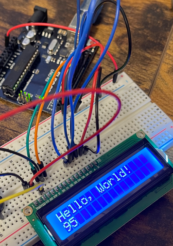
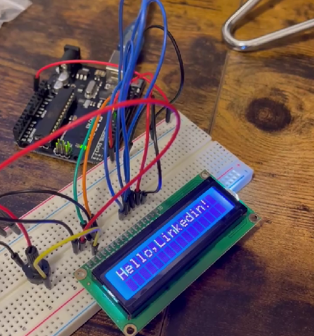

Arduino LCD Display Project
Hey there! 👋 this ia a fun and educational Arduino project featuring an LCD display.
This project allows you to showcase text messages on a two-row display with up to 16 characters each. 
I'm excited to share my work with the community on GitHub!

Project Overview:
In this project, I successfully wired up and utilized the LCD display to print custom messages using Arduino Uno. 
The display has an LED backlight, and I even incorporated a potentiometer to control the contrast. 
The code included in this repository demonstrates how to set up the hardware and display messages on the LCD.

Completed Features:
Display "Hello,Linkedin!" on the LCD screen upon startup.
Periodically change messages on the screen to showcase personal details.
Easily customizable code for your own messages and display configurations.

Components Used:
1x Elegoo Uno R3
1x LCD1602 module
1x Potentiometer (10k)
1x 830 tie-points Breadboard
16x M-M wires (Male to Male jumper wires)
